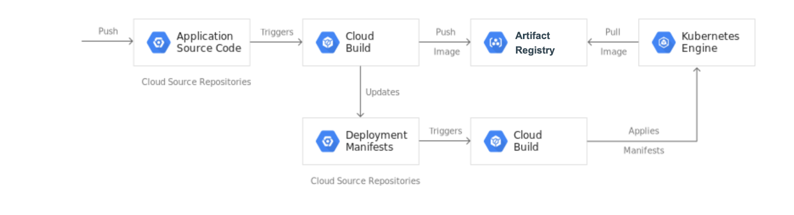
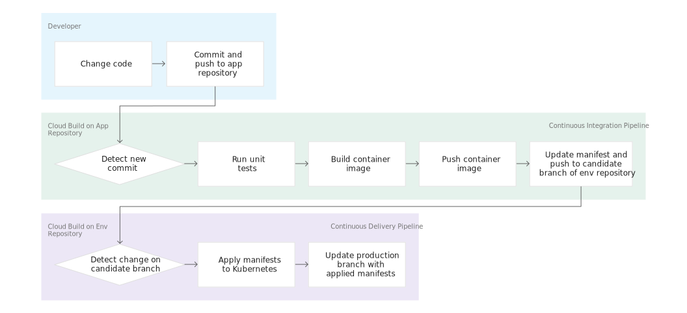
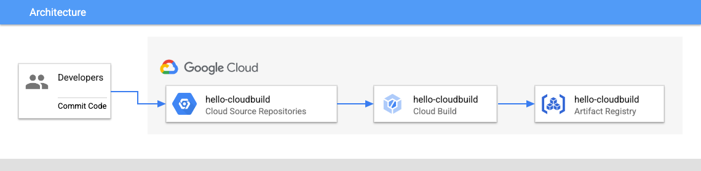
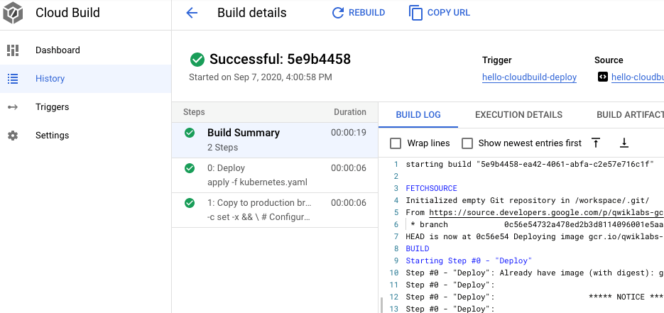
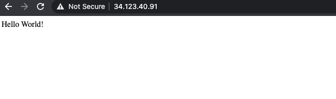
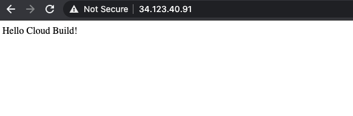

# Visão geral

O Cloud Build é um serviço que executa seus builds no Google Cloud. Ele pode importar código-fonte, executar builds e muito mais.

Neste laboratório, você cria uma pipeline de integração contínua e entrega contínua (CI/CD) que cria automaticamente uma imagem de contêiner a partir do código enviado, armazena a imagem no Artifact Registry, atualiza um manifesto Kubernetes em um repositório Git e implanta a aplicação no Google Kubernetes Engine usando esse manifesto.

Para este laboratório, você utiliza 2 repositórios Git hospedados em um servidor Gitea dedicado (git-server):

- **app**: contém o código-fonte da aplicação (`hello-cloudbuild-app`)
- **env**: contém os manifestos de deployment do Kubernetes (`hello-cloudbuild-env`)

Quando você envia uma alteração para o repositório `app`, a pipeline do Cloud Build executa os testes, cria uma imagem de contêiner e envia a alteração para o Artifact Registry. Depois de enviar a imagem, o Cloud Build atualiza o manifesto de deployment e o envia para o repositório `env`. Isso aciona outra pipeline do Cloud Build que aplica o manifesto ao cluster GKE e, se for bem-sucedida, armazena o manifesto em outra branch do repositório `env`.

O repositório `app` e o repositório `env` são mantidos separados porque possuem ciclos de vida e usos diferentes. O repositório `app` é dedicado a uma aplicação específica e é usado principalmente por pessoas. O repositório `env` pode ser compartilhado por várias aplicações e é usado por sistemas automatizados, como o Cloud Build. O repositório `env` pode ter várias branches, cada uma correspondendo a um ambiente específico e referenciando uma imagem de contêiner específica; o repositório `app` não possui essa característica.



Ao finalizar este laboratório, seu sistema poderá facilmente:

- Distinguir entre deployments com falha e bem-sucedidos observando o histórico do Cloud Build.
- Acessar o manifesto atualmente utilizado observando a branch `production` do repositório `env`.
- Fazer rollback para qualquer versão anterior executando novamente o build correspondente no Cloud Build.



# Objetivos

Neste laboratório, você aprenderá a realizar as seguintes tarefas:

- Criar clusters do Kubernetes Engine.
- Conectar-se a um servidor Git dedicado e inicializar repositórios Git.
- Executar pipelines do Cloud Build a partir de repositórios de código-fonte.
- Automatizar testes e publicar uma imagem de contêiner implantável usando o Cloud Build.
- Gerenciar recursos implantados em um cluster do Kubernetes Engine usando o Cloud Build.


# Task 1. Inicializar seu laboratório

Nesta tarefa, você configura seu ambiente:

- Importar o ID do projeto, o número do projeto e o IP do servidor Git como variáveis.
- Ativar as APIs do GKE, Cloud Build, Secret Manager e Artifact Analysis.
- Criar um repositório Docker no Artifact Registry.
- Criar um cluster GKE para implantar a aplicação de exemplo deste laboratório.

## 1. No Cloud Shell, execute o seguinte comando para definir o ID do projeto, o número do projeto e a região:

```bash
export PROJECT_ID=$(gcloud config get-value project)
export PROJECT_NUMBER=$(gcloud projects describe $PROJECT_ID \
--format='value(projectNumber)')
export REGION=
gcloud config set compute/region $REGION
export GIT_SERVER_IP=$(gcloud compute instances describe git-server \
--zone= --format='get(networkInterfaces[0].accessConfigs[0].natIP)')
echo "Git Server IP is: ${GIT_SERVER_IP}"
```

## 2. Execute o seguinte comando para ativar as APIs do GKE, Cloud Build, Secret Manager e Artifact Analysis:

```bash
gcloud services enable container.googleapis.com \
  cloudbuild.googleapis.com \
  secretmanager.googleapis.com \
  containeranalysis.googleapis.com
```

## 3. Crie um repositório Docker do Artifact Registry chamado `my-repository` na região definida no início do laboratório para armazenar suas imagens de contêiner:

```bash
gcloud artifacts repositories create my-repository \
  --repository-format=docker \
  --location=$REGION
```

## 4. Crie um cluster GKE para implantar a aplicação de exemplo deste laboratório:

```bash
gcloud container clusters create hello-cloudbuild --num-nodes 1 --region \
$REGION
```

## 5. Execute o seguinte comando para configurar o Git no Cloud Shell:

```bash
git config --global user.name "giteaadmin"
git config --global user.email "student@qwiklabs.net"
```

# Task 2. Conectar aos repositórios Git no servidor Git

Nesta tarefa, você inicializa os dois repositórios Git (`hello-cloudbuild-app` e `hello-cloudbuild-env`) no seu servidor Git dedicado (`git-server`) e envia o código de exemplo inicial.

## 1. Baixe o código de exemplo do Cloud Storage:

```bash
cd ~
mkdir hello-cloudbuild-app
gcloud storage cp -r gs://spls/gsp1077/gke-gitops-tutorial-cloudbuild/* \
hello-cloudbuild-app
```

## 2. Configure o remote do servidor Git e envie o código inicial para a branch `main`:

```bash
cd ~/hello-cloudbuild-app
export REGION="REGION"
sed -i "s/us-central1/$REGION/g" cloudbuild.yaml
sed -i "s/us-central1/$REGION/g" cloudbuild-delivery.yaml
sed -i "s/us-central1/$REGION/g" cloudbuild-trigger-cd.yaml
sed -i "s/us-central1/$REGION/g" kubernetes.yaml.tpl
git init
git remote add origin http://${GIT_SERVER_IP}:3000/giteaadmin/hello-cloudbuild-app.git
git branch -m main
git add . && git commit -m "initial commit"
git push -u \
http://giteaadmin:GiteaPassword123@${GIT_SERVER_IP}:3000/giteaadmin/hello-cloudbuild-app.git main
```

O código que você clonou contém uma aplicação simples "Hello World":

```python
from flask import Flask
app = Flask('hello-cloudbuild')
@app.route('/')
def hello():
  return "Hello World!\n"
if __name__ == '__main__':
  app.run(host = '0.0.0.0', port = 8080)
```

# Task 3. Criar uma imagem de contêiner com o Cloud Build

Nesta tarefa, usando um Dockerfile existente, você utiliza o Cloud Build para criar e armazenar uma imagem de contêiner.

O código que você clonou anteriormente contém o Dockerfile:

```dockerfile
FROM python:3.7-slim
RUN pip install flask
WORKDIR /app
COPY app.py /app/app.py
ENTRYPOINT ["python"]
CMD ["/app/app.py"]
```

Com este Dockerfile, você pode usar o Cloud Build para criar uma imagem de contêiner e armazená-la no Artifact Registry.

## 1. No Cloud Shell, crie um build do Cloud Build baseado no commit mais recente com o seguinte comando:

```bash
cd ~/hello-cloudbuild-app
COMMIT_ID="$(git rev-parse --short=7 HEAD)"
gcloud builds submit --tag="${REGION}-docker.pkg.dev/${PROJECT_ID}/my-repository/hello-cloudbuild:${COMMIT_ID}" .
```

O Cloud Build transmite para o seu terminal os logs gerados durante a criação da imagem quando você executa o comando.

## 2. Depois que o build for concluído, no Google Cloud Console, digite `Artifact Registry` no campo de pesquisa da barra de título e clique em Artifact Registry nos resultados da pesquisa. Verifique se a nova imagem de contêiner está disponível no Artifact Registry. Clique em `my-repository` para visualizar a imagem `hello-cloudbuild` na lista de imagens.

# Task 4. Criar e executar a pipeline de Integração Contínua (CI)

Nesta tarefa, você configura e executa o Cloud Build para executar automaticamente os testes unitários, criar a imagem de contêiner e enviá-la para o Artifact Registry.



O arquivo `cloudbuild.yaml`, já incluído no código, é a configuração da pipeline.

## 1. Faça commit das alterações e envie-as para o servidor Git:

```bash
cd ~/hello-cloudbuild-app
git add .
git commit -m "Trigger CI pipeline"
git push \
http://giteaadmin:GiteaPassword123@${GIT_SERVER_IP}:3000/giteaadmin/hello-cloudbuild-app.git \
main
```

## 2. Envie o build para o Cloud Build usando o seguinte comando:

```bash
gcloud builds submit --config=cloudbuild.yaml \
--substitutions=SHORT_SHA=$(git rev-parse --short=7 HEAD) .
```

## 3. No Google Cloud Console, pesquise por `Cloud Build` e clique em `History` no painel esquerdo. Você poderá examinar o log de execução do seu build de CI.

# Task 5. Armazenar a chave SSH secreta no Secret Manager

Nesta etapa, você armazena uma chave privada como segredo no Secret Manager e concede ao Cloud Build permissões para acessar o Secret Manager.

## Criar uma chave SSH e armazená-la no Secret Manager

### 1. No Cloud Shell, crie uma chave SSH:

```bash
mkdir -p ~/workingdir && cd ~/workingdir
ssh-keygen -t rsa -b 4096 -N '' -f id_rsa -C "student@qwiklabs.net"
```

### 2. Armazene a chave SSH privada no Secret Manager executando o seguinte comando no Cloud Shell:

```bash
gcloud secrets create ssh_key_secret --data-file=$HOME/workingdir/id_rsa
```

Como alternativa, no Google Cloud Console:

1. Primeiro, baixe `id_rsa` para o seu computador: no Cloud Shell, clique em **More** > **Download file**, informe `workingdir/id_rsa` e clique em **Download**.
2. Pesquise por **Secret Manager** e clique em **Secret Manager**.
3. Clique em **Create Secret**.
4. Defina **Name** como `ssh_key_secret`.
5. Em **Secret value**, selecione **Upload** e envie o arquivo `id_rsa` baixado.
6. Clique em **Create secret**.

## Conceder permissão à conta de serviço para acessar o Secret Manager

Execute o seguinte comando no Cloud Shell para conceder à conta de serviço padrão do Compute Engine permissão para acessar o Secret Manager:

```bash
PROJECT_NUMBER=$(gcloud projects describe ${PROJECT_ID} \
--format='value(projectNumber)')

gcloud projects add-iam-policy-binding ${PROJECT_NUMBER} \
  --member=serviceAccount:${PROJECT_NUMBER}-compute@developer.gserviceaccount.com \
  --role=roles/secretmanager.secretAccessor
```

# Task 6. Criar o ambiente de testes e a pipeline CD

Você também pode usar o Cloud Build para a pipeline de entrega contínua. A pipeline é executada sempre que um commit é enviado para a branch `candidate` do repositório `hello-cloudbuild-env`. A pipeline aplica a nova versão do manifesto ao cluster Kubernetes e, se for bem-sucedida, copia o manifesto para a branch `production`.

Este processo possui as seguintes características:

- A branch `candidate` é um histórico das tentativas de deployment.
- A branch `production` é um histórico dos deployments bem-sucedidos.
- Você tem uma visão dos deployments bem-sucedidos e com falha no Cloud Build.
- Você pode fazer rollback para qualquer deployment anterior executando novamente o build correspondente no Cloud Build. Um rollback também atualiza a branch `production` para refletir corretamente o histórico dos deployments.


Em seguida, você modifica a pipeline de integração contínua para atualizar a branch `candidate` do repositório `hello-cloudbuild-env`, acionando a pipeline de entrega contínua.

## Conceder ao Cloud Build acesso ao GKE

Para implantar a aplicação no seu cluster Kubernetes, o Cloud Build precisa da função **Kubernetes Engine Developer**.

### 1. No Cloud Shell, execute o seguinte comando:

```bash
PROJECT_NUMBER="$(gcloud projects describe ${PROJECT_ID} --format='get(projectNumber)')"
gcloud projects add-iam-policy-binding ${PROJECT_NUMBER} \
  --member=serviceAccount:${PROJECT_NUMBER}@cloudbuild.gserviceaccount.com \
  --role=roles/container.developer
```

Você precisa inicializar o repositório `hello-cloudbuild-env` com duas branches (`production` e `candidate`) e um arquivo de configuração do Cloud Build descrevendo o processo de deployment.

### 2. No Cloud Shell, baixe o código de exemplo do Cloud Storage:

```bash
mkdir ~/hello-cloudbuild-env
gcloud storage cp -r gs://spls/gsp1077/gke-gitops-tutorial-cloudbuild/* ~/hello-cloudbuild-env
cd ~/hello-cloudbuild-env
export REGION="REGION"
sed -i "s/us-central1/$REGION/g" cloudbuild.yaml
sed -i "s/us-central1/$REGION/g" cloudbuild-delivery.yaml
sed -i "s/us-central1/$REGION/g" cloudbuild-trigger-cd.yaml
sed -i "s/us-central1/$REGION/g" kubernetes.yaml.tpl
```

### 3. Inicialize o repositório `hello-cloudbuild-env` no servidor Git:

```bash
cd ~/hello-cloudbuild-env
git init
git remote add origin http://${GIT_SERVER_IP}:3000/giteaadmin/hello-cloudbuild-env.git
git branch -m main
git add . && git commit -m "initial commit"
git push -u http://giteaadmin:GiteaPassword123@${GIT_SERVER_IP}:3000/giteaadmin/hello-cloudbuild-env.git main
```

### 4. Crie as branches `production` e `candidate` e envie-as:

```bash
cd ~/hello-cloudbuild-env
git checkout -b production
git checkout -b candidate
git push http://giteaadmin:GiteaPassword123@${GIT_SERVER_IP}:3000/giteaadmin/hello-cloudbuild-env.git production
git push http://giteaadmin:GiteaPassword123@${GIT_SERVER_IP}:3000/giteaadmin/hello-cloudbuild-env.git candidate
```

### 5. No Cloud Shell, substitua o conteúdo de `cloudbuild.yaml` no repositório `hello-cloudbuild-env` executando os seguintes comandos:

```bash
cd ~/hello-cloudbuild-env
cat <<'EOF' > cloudbuild.yaml
# Copyright 2018 Google LLC
#
# Licensed under the Apache License, Version 2.0 (the "License");
# you may not use this file except in compliance with the License.
# You may obtain a copy of the License at
#
# https://www.apache.org/licenses/LICENSE-2.0
#
# Unless required by applicable law or agreed to in writing, software
# distributed under the License is distributed on an "AS IS" BASIS,
# WITHOUT WARRANTIES OR CONDITIONS OF ANY KIND, either express or implied.
# See the License for the specific language governing permissions and
# limitations under the License.
substitutions:
  _COMMIT_SHA: 'v1.0'
steps:
```

O arquivo contém uma etapa que implanta a nova versão da imagem de contêiner no cluster Kubernetes Engine:

```yaml
# This step deploys the new version of our container image
# in the hello-cloudbuild Kubernetes Engine cluster.
- name: 'gcr.io/cloud-builders/kubectl'
  id: Deploy
  args:
    - 'apply'
    - '-f'
    - 'kubernetes.yaml'
  env:
    - 'CLOUDSDK_COMPUTE_REGION='
    - 'CLOUDSDK_CONTAINER_CLUSTER=hello-cloudbuild'

# This step copies the applied manifest to the production branch
- name: 'gcr.io/cloud-builders/gcloud'
  id: Copy to production branch
  entrypoint: /bin/sh
  args:
    - '-c'
    - |
      set -x && \
      git clone -b production http://giteaadmin:GiteaPassword123@${GIT_SERVER_IP}:3000/giteaadmin/hello-cloudbuild-env.git prod_repo && \
      cd prod_repo && \
      git config user.email "student@qwiklabs.net" && \
      git config user.name "Cloud Build" && \
      cp ../kubernetes.yaml kubernetes.yaml && \
      git add kubernetes.yaml && \
      git commit -m "Deployed manifest from commit $_COMMIT_SHA" && \
      git push origin production
```

```yaml
options:
  logging: CLOUD_LOGGING_ONLY
EOF
```

```bash
sed -i "s/\${GIT_SERVER_IP}/$GIT_SERVER_IP/g" cloudbuild.yaml
```

## Fazer commit e enviar a atualização para `hello-cloudbuild-env`

```bash
cd ~/hello-cloudbuild-env
git checkout candidate
git add cloudbuild.yaml
git commit -m "Create cloudbuild.yaml for deployment"
git push http://giteaadmin:GiteaPassword123@${GIT_SERVER_IP}:3000/giteaadmin/hello-cloudbuild-env.git \
candidate
```

## Modificar a pipeline de integração contínua para acionar a pipeline de entrega contínua

Em seguida, atualize a pipeline de integração contínua em `hello-cloudbuild-app` para gerar uma nova versão do manifesto Kubernetes e enviá-la para `hello-cloudbuild-env`, acionando a pipeline CD.

### 1. No Cloud Shell, substitua `cloudbuild.yaml` em `hello-cloudbuild-app` e substitua o IP do servidor Git executando os seguintes comandos:

```bash
cd ~/hello-cloudbuild-app
cat <<'EOF' > cloudbuild.yaml
# Copyright 2018 Google LLC
#
# Licensed under the Apache License, Version 2.0 (the "License");
# you may not use this file except in compliance with the License.
# You may obtain a copy of the License at
#
# https://www.apache.org/licenses/LICENSE-2.0
#
# Unless required by applicable law or agreed to in writing, software
# distributed under the License is distributed on an "AS IS" BASIS,
# WITHOUT WARRANTIES OR CONDITIONS OF ANY KIND, either express or implied.
# See the License for the specific language governing permissions and
# limitations under the License.
substitutions:
  _SHORT_SHA: 'v1.0'
  _COMMIT_SHA: 'v1.0'
steps:
# This step runs the unit tests on the app
- name: 'python:3.7-slim'
  id: Test
  entrypoint: /bin/sh
  args:
    - -c
    - 'pip install flask && python test_app.py -v'

# This step builds the container image.
- name: 'gcr.io/cloud-builders/docker'
  id: Build
  args:
    - 'build'
    - '-t'
    - '-docker.pkg.dev/$PROJECT_ID/my-repository/hello-cloudbuild:$_SHORT_SHA'
    - '.'
```

O arquivo também contém a etapa responsável por enviar a imagem para o Artifact Registry:

```yaml
# This step pushes the image to Artifact Registry
- name: 'gcr.io/cloud-builders/docker'
  id: Push
  args:
    - 'push'
    - '-docker.pkg.dev/$PROJECT_ID/my-repository/hello-cloudbuild:$_SHORT_SHA'

# This step clones the hello-cloudbuild-env repository
- name: 'gcr.io/cloud-builders/gcloud'
  id: Clone env repo
  entrypoint: /bin/sh
  args:
    - '-c'
    - |
      git clone http://giteaadmin:GiteaPassword123@${GIT_SERVER_IP}:3000/giteaadmin/hello-cloudbuild-env.git && \
      cd hello-cloudbuild-env && \
      git checkout candidate && \
      git config user.email "student@qwiklabs.net" && \
      git config user.name "Cloud Build"

# This step generates the new manifest
- name: 'gcr.io/cloud-builders/gcloud'
  id: Generate manifest
  entrypoint: /bin/sh
  args:
    - '-c'
    - |
      sed "s/GOOGLE_CLOUD_PROJECT/${PROJECT_ID}/g" kubernetes.yaml.tpl | \
      sed "s/COMMIT_SHA/${_SHORT_SHA}/g" > hello-cloudbuild-env/kubernetes.yaml
```

A etapa seguinte envia o manifesto para a branch `candidate`:

```yaml
# This step pushes the manifest back to hello-cloudbuild-env candidate branch
- name: 'gcr.io/cloud-builders/gcloud'
  id: Push manifest
  entrypoint: /bin/sh
  args:
    - '-c'
    - |
      set -x && \
      cd hello-cloudbuild-env && \
      git add kubernetes.yaml && \
      git commit -m "Deploying image -docker.pkg.dev/$PROJECT_ID/my-repository/hello-cloudbuild:${_SHORT_SHA}
      Built from commit ${_COMMIT_SHA} of repository hello-cloudbuild-app
      Author: $(git log --format='%an <%ae>' -n 1 HEAD)" && \
      git push origin candidate
options:
  logging: CLOUD_LOGGING_ONLY
EOF
```

```bash
sed -i "s/\${GIT_SERVER_IP}/$GIT_SERVER_IP/g" cloudbuild.yaml
```

### 2. Faça commit das modificações, envie-as para o servidor Git e envie o build da pipeline:

```bash
cd ~/hello-cloudbuild-app
git add cloudbuild.yaml
git commit -m "Trigger CD pipeline"
git push http://giteaadmin:GiteaPassword123@${GIT_SERVER_IP}:3000/giteaadmin/hello-cloudbuild-app.git \
main

gcloud builds submit --config=cloudbuild.yaml \
--substitutions=_SHORT_SHA=$(git rev-parse --short=7 HEAD),_COMMIT_SHA=$(git rev-parse HEAD) .
```

Isso aciona a pipeline de integração contínua no Cloud Build, que cria a imagem da aplicação e envia um novo manifesto `kubernetes.yaml` para o repositório `hello-cloudbuild-env`.

### 3. Baixe o manifesto gerado em `hello-cloudbuild-env` e acione o build de deployment da Entrega Contínua (CD):

```bash
cd ~/hello-cloudbuild-env
git pull http://giteaadmin:GiteaPassword123@${GIT_SERVER_IP}:3000/giteaadmin/hello-cloudbuild-env.git \
candidate

gcloud builds submit --config=cloudbuild.yaml \
--substitutions=_COMMIT_SHA=$(git rev-parse HEAD) .
```

# Task 7. Revisar a pipeline do Cloud Build

Nesta tarefa, você revisa a pipeline do Cloud Build no console.

## 1. No console, navegue até:

```text
Cloud Build > History
```

## 2. Clique no build mais recente para acompanhar sua execução e examinar seus logs.

## 3. Verifique se a pipeline executou todas as etapas com sucesso.



# Task 8. Testar a pipeline completa

Agora você configurou a pipeline CI/CD completa. Nesta tarefa, você realiza um teste de ponta a ponta.

## 1. No console, no menu de navegação, clique em:

```text
Kubernetes Engine > Gateways, Services & Ingress > Services
```

Deve haver um único serviço chamado `hello-cloudbuild` na lista. Ele foi criado pelo build de entrega contínua que acabou de ser executado.

## 2. Clique no endpoint do serviço `hello-cloudbuild`.

Você deverá visualizar:



Se não houver endpoint ou se aparecer um erro de load balancer, talvez seja necessário aguardar alguns minutos para que o load balancer seja completamente inicializado. Se necessário, clique em **Refresh** para atualizar a página.

## 3. No Cloud Shell, substitua `"Hello World"` por `"Hello Cloud Build"`, tanto na aplicação quanto no teste unitário:

```bash
cd ~/hello-cloudbuild-app
sed -i 's/Hello World/Hello Cloud Build/g' app.py
sed -i 's/Hello World/Hello Cloud Build/g' test_app.py
```

## 4. Faça commit e envie a alteração para o servidor Git e, em seguida, envie o build de CI:

```bash
git add app.py test_app.py
git commit -m "Hello Cloud Build"
git push \
http://giteaadmin:GiteaPassword123@${GIT_SERVER_IP}:3000/giteaadmin/hello-cloudbuild-app.git \
main

gcloud builds submit --config=cloudbuild.yaml \
--substitutions=_SHORT_SHA=$(git rev-parse --short=7 HEAD),_COMMIT_SHA=$(git \
rev-parse HEAD) .
```

## 5. Baixe o manifesto atualizado em `hello-cloudbuild-env` e envie o build da pipeline de deployment para implantar a nova versão da aplicação:

```bash
cd ~/hello-cloudbuild-env

git pull \
http://giteaadmin:GiteaPassword123@${GIT_SERVER_IP}:3000/giteaadmin/hello-cloudbuild-env.git candidate

gcloud builds submit --config=cloudbuild.yaml \
--substitutions=_COMMIT_SHA=$(git rev-parse HEAD) .
```

Depois de alguns minutos, recarregue a aplicação no navegador. Agora você deverá visualizar:



# Task 9. Testar o rollback

Nesta tarefa, você faz rollback para a versão da aplicação que exibia `"Hello World!"`.

## 1. Na barra de título do console, digite `Cloud Build Dashboard` no campo de pesquisa e clique em Cloud Build nos resultados da pesquisa.

Certifique-se de que `History` esteja selecionado no painel esquerdo.

## 2. Clique no segundo build mais recente disponível em Build History.

## 3. Clique em `Rebuild`.

# Conclusão

Parabéns! A pipeline CI/CD foi configurada e testada com sucesso.
